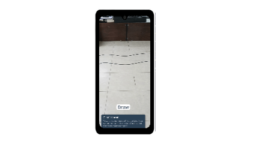
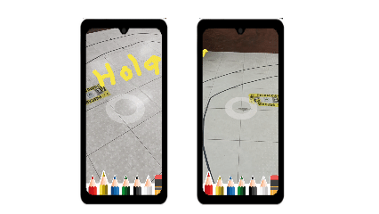

# A Framework for Collaborative Augmented Reality Applications | I3D 2025

<div align="center">
  
  <p><em>Figure: Real-time AR drawing synchronization between two mobile devices using our framework</em></p>
</div>

## Overview
This repository presents a framework designed to streamline the deployment and configuration of colocated collaborative augmented reality (AR) experiences for mobile devices (currently supporting ARCore-compatible devices). The solution employs a centralized client-server architecture, where a dedicated local server (PC) manages real-time data communication and synchronization across connected devices. This approach eliminates reliance on cloud anchor services or third-party platforms, which often impose restrictive limitations.

Perfect for:
- Prototyping multi-user AR experiences
- Collaborative projects
- AR education tools

## Project Structure
```
📁 CollabAR/ 
├── App/        # Includes the mobile application implementation that connects to and interacts with the server framework
├── Assets/     # Images and resources used in documentation
├── Server/     # Contains the complete architecture and technical configuration for the local server, including all necessary components and operational processes
└── README.md   # This documentation file
```

## Setting Workspace
Before proceeding with the setup steps below, ensure you have the following tools **installed and ready** on your system. While newer versions may work, we recommend using the exact version specified to ensure full compatibility. If you choose a different version, please verify it doesn't introduce breaking changes.

**Computer**: *Windows**/Mac/Linux with:
  - Node.js v24.14.1 ([Installation guide](https://nodejs.org/en/about/previous-releases))
  - MongoDB Community Edition v8.2.6 ([Installation guide](https://www.mongodb.com/try/download/community))
  - Git ([Installation guide](https://git-scm.com/))

**Phones**: 2+ Android devices with:
  - ARCore support ([Compatibility list](https://developers.google.com/ar/devices))
  - Developer mode enabled ([Developer mode](https://developer.android.com/studio/debug/dev-options))

**Note:** All setup instructions and commands in this guide were tested in Windows 11 (25H2) using Command Prompt (cmd). If you're using another operating system or shell, please adapt the commands accordingly.

### Step 1: Get the Code
**Clone the repository** as:
  ```bash
  git clone https://github.com/MurilloLog/CollabAR.git
  ```

**If you prefer downloading the project as a ZIP file:** Extract the contents and verify the folder structure matches the [Project structure](#project-structure) shown above.

### Step 2: Launch the Server
Before starting the server, ensure you have properly [configured it](./Server/README.md) and have the [applications ready](./App/README.md) on your devices.

1. **Open two Command Prompts** and navigate both to the `Server/` folder:
  ```bash
  cd CollabAR
  cd Server
  ```

2.  **In first terminal (Database-MongoDB)** start MongoDB service as:
   ```bash
   mongod
   ```
  And make sure avoiding to close the command prompt. You can verify MongoDB service is working when you receive the log message: ```"ctx":"initandlisten","msg":"mongod startup complete"```.

3. **In the second Terminal (Application-Node.js)** start the server as:
```bash
npm start
```
And look for the message: ```"Wating for connections..."``` to check that the server app is running without errors.

⚠️ **Important Notes**:

- Do not close either terminal window while using the application.
- Closing the first terminal ```mongod``` will shut down the database.
- Closing the second terminal ```npm start``` will stop the server.
- To stop the servers safely: Press ```Ctrl + C``` in each terminal to terminate processes gracefully.

## Using the App

### 1. Prepare Devices
**Initial Positioning:** Before launching the app, place all devices side by side, pointing their cameras toward the same flat surface (table or floor). This initial alignment is critical. Any offset at the start will cause spatial synchronization mismatches between devices throughout the entire experience.

<div align="center">
  
</div>

### 2. Connect to Server
1. **Enter the server address:** Input the IP address of the computer running the server (the machine where you executed *npm start*). The default port is 8080. 
**Note:** These parameters can be modified or automated-refer to [Server.md](./Server/README.md#configuration) for configuration details.

2. **Tap "Join":** This initiates the connection. The experience will not begin until at least two devices are connected.

3. **Wait for synchronization:** While waiting for the second device, the app displays a loading screen *(Loading players)* and drawing controls remain disabled. Once the second device joins:

- The loading screen disappears

- A new *Drawing* button appears

⚠️ **Important:** All devices must be connected to the same Wi-Fi network to communicate with the server.

### 3. Start drawing
Ensure your device has completed spatial mapping:

- You'll see a circular cursor appearing on detected planes

- Small anchor points will overlay on recognized surfaces

- Only when these visual indicators appear, tap "Draw" button to begin

💡 **Tip:** Spatial mapping is dynamic. As you walk around, new anchor points will continuously register, improving spatial awareness and drawing accuracy across the environment.

### 4. Draw and Collaborate
- Choose colors from the palette in your app
- Draw in the air - strokes appear when you finish; all connected devices see your drawings in real time
- Walk around - drawings remain anchored to their physical locations as you move

<div align="center">
  
</div>

### 5. Verification
To confirm devices are properly connected:

- Check the server terminal logs for messages like:

  - "Connecting to MongoDB..."
  - "Successful connection..."
  - "Waiting for connections..." 

## Common Questions
**Q: Why do devices need to be close together at the begining?**

A: Devices need to be close to share the same AR space and use a common reference point from the starting position for accurate synchronization

**Q: Can I use iPhones?**

A: Currently Android-only (ARCore requirement), but iOS support could be added

**Q: How many users can join simultaneously?**

A. The system was tested with 5 simultaneous connections, but practical performance depends on:
- The PC specifications (CPU/RAM)
- Network conditions (latency and stability)
- Drawing complexity (size/detail of shared AR content)

## Please kindly cite our paper as:
```
@inproceedings{10.1145/3722564.3728390,
author = {Murillo Gutierrez, Gustavo Adolfo and Jin, Rong and Ramirez Paredes, Juan Pablo Ignacio and Hernandez Belmonte, Uriel Haile},
title = {A Framework for Collaborative Augmented Reality Applications},
year = {2025},
isbn = {9798400718335},
publisher = {Association for Computing Machinery},
address = {New York, NY, USA},
url = {https://doi.org/10.1145/3722564.3728390},
doi = {10.1145/3722564.3728390},
series = {I3D Companion '25}
}
```


